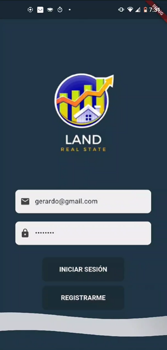

# 🖼️ CÓMO AÑADIR LAS IMÁGENES DE TUS PROYECTOS FREELANCER

## 📍 Ubicación de las Carpetas

Las carpetas ya están creadas en tu proyecto. Solo necesitas colocar las imágenes enumeradas que mencionaste.

```
CurriculumGCR/
└── img/
    └── portfolio/
        ├── thumb/          ← Imágenes pequeñas (portada)
        │   ├── project-5.png    (Land)
        │   ├── project-6.png    (Truck)
        │   └── project-7.png    (Racoon)
        └── large/          ← Imágenes grandes (galería)
            ├── project-5/
            │   ├── 1.png
            │   ├── 2.png
            │   └── ...
            ├── project-6/
            │   ├── 1.png
            │   ├── 2.png
            │   └── ...
            └── project-7/
                ├── 1.png
                ├── 2.png
                └── ...
```

## 📋 Instrucciones Paso a Paso

### Paso 1: Organiza tus imágenes localmente
Primero, coloca todas tus imágenes en una carpeta temporal organizadas por proyecto:
- Land/ (todas tus imágenes de Land)
- Truck/ (todas tus imágenes de Truck)
- Racoon/ (todas tus imágenes de Racoon)

### Paso 2: Copia las imágenes thumbnail
1. Selecciona la mejor imagen de cada proyecto (la más representativa)
2. Redimensiona cada una a: **400px × 300px** o **500px × 350px**
3. Expórtala como PNG
4. Coloca en:
   - `img/portfolio/thumb/project-5.png` (Land)
   - `img/portfolio/thumb/project-6.png` (Truck)
   - `img/portfolio/thumb/project-7.png` (Racoon)

### Paso 3: Copia las imágenes grandes
1. Toma todas las imágenes enumeradas que ya tienes (1.png, 2.png, etc.)
2. Redimensionalas a: **1200px × 800px** o **1400px × 900px**
3. Coloca en las carpetas correspondientes:
   - `img/portfolio/large/project-5/` (todas las imágenes de Land)
   - `img/portfolio/large/project-6/` (todas las imágenes de Truck)
   - `img/portfolio/large/project-7/` (todas las imágenes de Racoon)

## 🎯 Detalles de Cada Proyecto

### PROJECT-5: LAND (Aplicación Inmobiliaria)
- **Formato:** PNG o JPG
- **Thumbnail:** `project-5.png`
- **Carpeta grande:** `project-5/`
- **Imágenes sugeridas:**
  1. Pantalla principal / Inicio
  2. Listado de propiedades
  3. Detalle de propiedad
  4. Contacto/Chat

### PROJECT-6: TRUCK (Plataforma Web)
- **Formato:** PNG o JPG
- **Thumbnail:** `project-6.png`
- **Carpeta grande:** `project-6/`
- **Imágenes sugeridas:**
  1. Inicio/Home
  2. Catálogo de vehículos
  3. Detalle del vehículo
  4. Sección de contacto/cotización

### PROJECT-7: RACOON (Entregas)
- **Formato:** PNG o JPG
- **Thumbnail:** `project-7.png`
- **Carpeta grande:** `project-7/`
- **Imágenes sugeridas:**
  1. Pantalla de inicio
  2. Mapa con entregas
  3. Detalle de pedido
  4. Perfil de repartidor

## 💡 Consejos para las Imágenes

✅ **Usa imágenes de alta calidad**
✅ **Mantén consistencia visual** (mismo estilo de filtros)
✅ **Incluye mockups** si es posible (teléfono/monitor)
✅ **Las imágenes deben mostrar la funcionalidad** del proyecto
✅ **Considera agradecer a los clientes** si usas sus imágenes reales
✅ **Asegúrate de tener permisos** para usar las imágenes

## 🔍 Validación Después de Añadir Imágenes

Una vez que hayas añadido las imágenes:

1. Abre `index.html` en tu navegador
2. Ve a la sección "Portafolio"
3. Verifica que aparezcan las miniaturas de los 3 nuevos proyectos
4. Haz clic en cada una para ver si aparecen las imágenes grandes correctamente
5. Prueba los filtros: "Todas", "Aplicaciones Móviles", "Aplicaciones Web"

## 📱 Responsive Design

No te preocupes por el responsivo - ya está todo configurado:
- En móvil: 1 proyecto por fila
- En tablet: 2 proyectos por fila
- En desktop: 3 proyectos por fila

Las imágenes se escalarán automáticamente.

## ✨ Resumen del HTML

El código HTML ya está completamente configurado:
```html

```

Solo necesitas reemplazar tus archivos PNG en las rutas especificadas.

---

**¡Todo está listo! Solo falta colocar tus imágenes.**

Para más información sobre los proyectos, consulta:
- `RESUMEN_ACTUALIZACION_FREELANCER.md`
